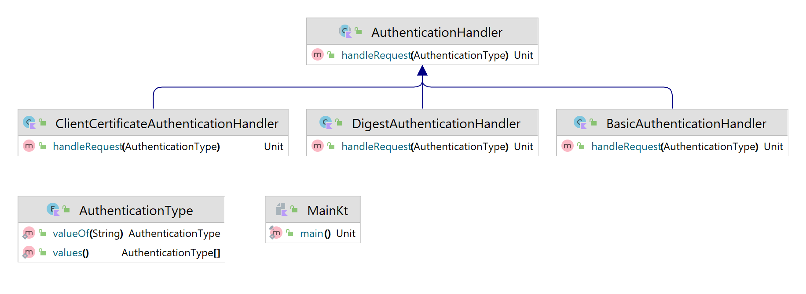

# Chain Of Responsibility Design Pattern

O padrão de design da Chain of Responsibility permite que um objeto envie um comando sem saber qual objeto receberá e manipulará. A solicitação é enviada de um objeto para outro, tornando-os partes de uma cadeia e cada objeto dessa cadeia pode manipular o comando, transmiti-lo ou fazer os dois.



Usage:
```kotlin
fun main() {
    fun main() {
        val authHandler = ClientCertificateAuthenticationHandler(
                next = BasicAuthenticationHandler(
                        next = DigestAuthenticationHandler(
                                next = null
                        )
                )
        )

        authHandler.handleRequest(AuthenticationType.DIGEST)
        authHandler.handleRequest(AuthenticationType.BASIC)
        authHandler.handleRequest(AuthenticationType.CLIENT_CERTIFICATE)
    }
}
```


Output:
```text
Handling a Digest Authentication
Handling a Basic Authentication
Handling a Client Certificate Authentication
```