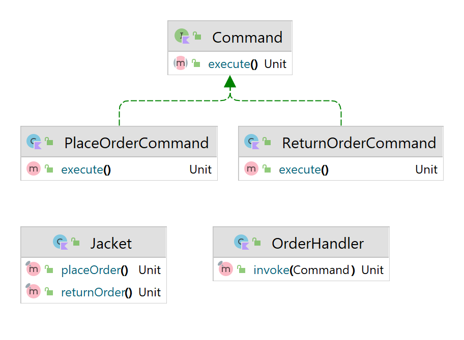

# Command Design Pattern

O command desacopla o objeto que chama a operação daquele que sabe como executá-la. Para conseguir essa separação, o designer cria uma classe base abstrata que mapeia um receiver (um objeto) com uma ação (um ponteiro para uma função de um membro). A classe base contém um método Execute() que simplesmente chama a ação no “receiver”.


Usage:
```kotlin
fun main() {
    fun main() {
        val jacket = Jacket()

        with(OrderHandler()) {
            invoke(PlaceOrderCommand(jacket))
            invoke(ReturnOrderCommand(jacket))
        }
    }
}
```


Output:
```text
Jacket order has been placed
Jacket order has been returned
```