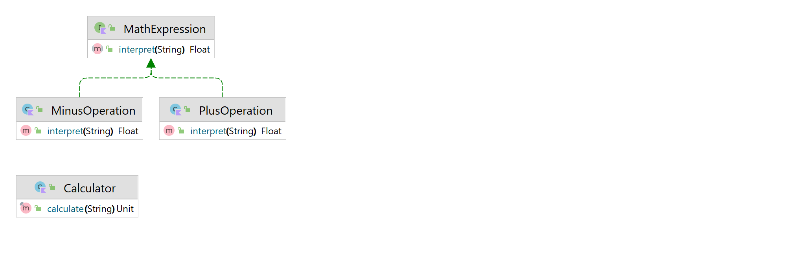

# Interpreter Design Pattern

O padrão Interpreter discute: definir uma linguagem de domínio (ou seja, caracterização do problema) como uma gramática simples, representando regras de domínio como sentenças de linguagem e interpretar essas sentenças para resolver o problema. O padrão usa uma classe para representar cada regra gramatical. E como as gramáticas geralmente têm uma estrutura hierárquica, uma hierarquia de herança de classes de regra é bem mapeada.

Usage:
```kotlin
fun main() {
    with(Calculator()) {
        calculate("1 + 2 + 3 + 5 + 8 - 9")
        calculate("20 - 5 + 10")
    }
}
```


Output:
```text
10.0
30.0
```