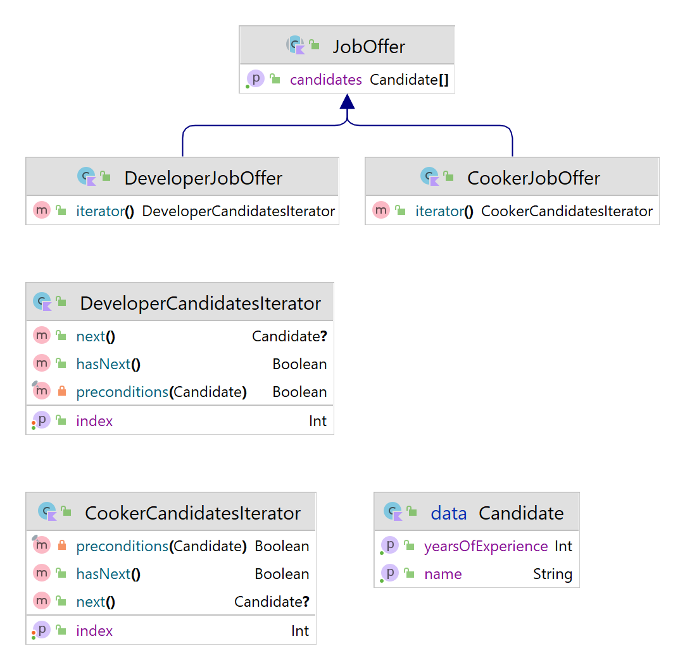

# Iterator Design Pattern

A idéia principal do padrão Iterator é extrair o comportamento de travessia de uma coleção em um objeto separado chamado iterador .

Além de implementar o próprio algoritmo, um objeto iterador encapsula todos os detalhes da travessia, como a posição atual e quantos elementos restam até o final. Por esse motivo, vários iteradores podem passar pela mesma coleção ao mesmo tempo, independentemente um do outro.


Usage:
```kotlin
fun main() {
    val cookerJobOffer = JobOffer(zak, alice, sara, anna)

    val cookersIterator = CookerCandidatesIterator(cookerJobOffer)

    println("Cookers with preconditions to the job offer:")
    while (cookersIterator.hasNext()) {
        cookersIterator.next()?.name?.let { println(it) }
    }

    print("\n")

    val developerJobOffer = JobOffer(zak, alice, sara, anna)
    val developersIterator = DeveloperCandidatesIterator(developerJobOffer)

    println("Developers with preconditions to the job offer:")
    while (developersIterator.hasNext()) {
        developersIterator.next()?.name?.let { println(it) }
    }
}
```


Output:
```text
Cookers with preconditions to the job offer:
Sarah
Anna

Developers with preconditions to the job offer:
Sarah
```