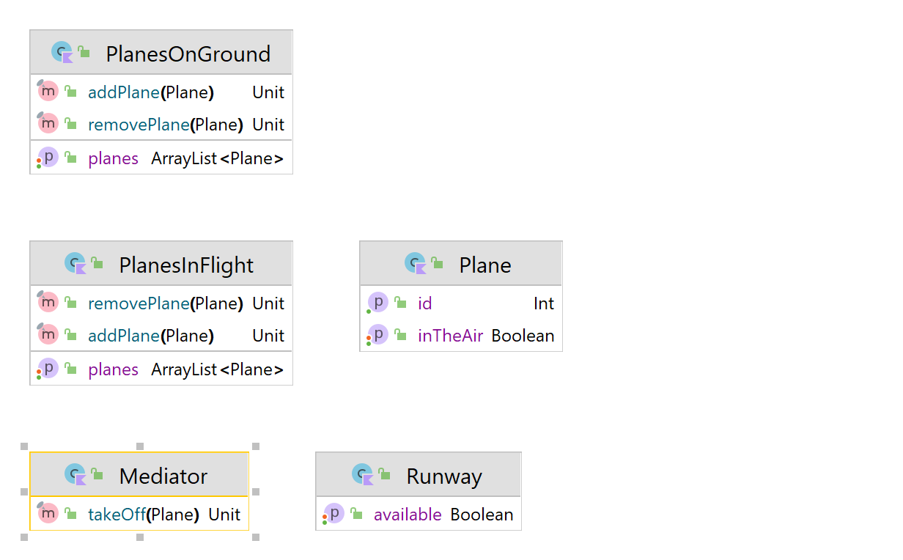

# Mediator Design Pattern

O padrão mediator sugere que você interrompa toda a comunicação direta entre os componentes que deseja tornar independentes um do outro. Em vez disso, esses componentes devem colaborar indiretamente, chamando um objeto mediator especial que redireciona as chamadas para os componentes apropriados. Como resultado, os componentes dependem apenas de uma única classe de mediator em vez de serem acoplados a dezenas de classes.



Usage:
```kotlin
fun main() {
    val mediator = Mediator()

    val plane1 = Plane(id = 1)
    val plane2 = Plane(id = 2)

    mediator.takeOff(plane1)
    mediator.takeOff(plane2)
}
```

Output:
```text
Plane 1 is taking off...
Plane 2 is taking off...
```