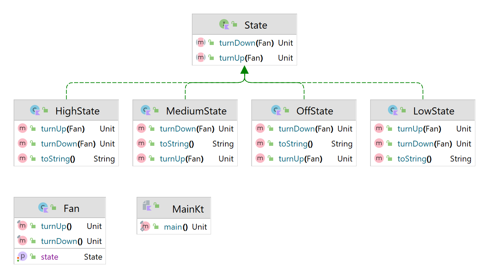

# State Design Pattern

O Design Pattern do State sugere que você crie classes para todos os estados possíveis de um objeto e extraia todos os comportamentos específicos do estado para essas classes. Em vez de implementar todos os comportamentos por conta própria, o objeto original, chamado Context, armazena uma referência a um dos objetos de estado que representa seu estado atual e delega todo o trabalho relacionado ao estado a esse objeto.



Usage:
```kotlin
fun main() {
    with(Fan()){
        turnUp()
        turnUp()
        turnUp()
        turnDown()
        turnDown()
        turnDown()
    }
}
```


Output:
```text
Turned up to Low
Turned up to Medium
Turned up to High
Turned down to Medium
Turned down to Low
Turned down to Off
```